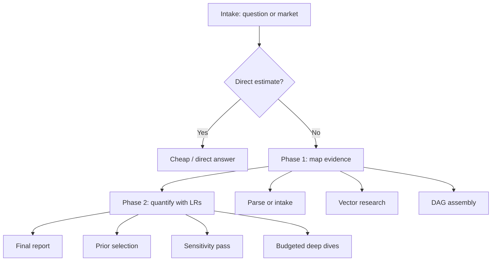

# Review: Root Probability Workflow Skill

Reviewed the `estimate-probability` workflow and its key child skills. The reusable core is a gated map->quantify pipeline with vectorized evidence gathering, DAG assembly, LR-based quantification, and recursive deep dives; the main ForecastBench changes are earlier question triage, non-Polymarket intake, and a cheaper default path for non-priority questions.

## Findings
1. The advertised generic-question path is not reusable as-is. The root skill routes plain-language questions directly to `exploration-manager`, but `exploration-manager` still requires a parsed contract node and errors if it is missing, while `causal-explorer` also reads that same parsed-contract node before doing any work. Relevant lines: root `SKILL.md` 109-131, `exploration-manager/SKILL.md` 33-45, `causal-explorer/SKILL.md` 23-32.
2. The social-sentiment vector has a portability risk. It looks for `*/workflows/estimate_probability/.env`, but the reviewed workflow lives under `workflows/evaluation/probability`; a quick search under `/Users/lochlan/voicetree` did not find a matching `.env` file. Relevant lines: `causal-explorer/SKILL.md` 63-68.
3. Phase labels drift in the child docs. `question-parser` says it hands off to exploration-manager for "Phase 2", and `dag-assembler` says it reads output from "Phase 2" even though both belong to the mapping side. This is mostly a documentation issue, but it increases the chance of copying the wrong boundary into ForecastBench.

## Reusable Skeleton
1. Intake accepts either a market object or a plain-language question plus `DEPTH_BUDGET` and `HUMAN_REVIEW`.
2. A direct-estimation gate prevents unnecessary fan-out for trivial or already-known questions.
3. Phase 1 maps the problem structurally: parse intake, classify domain, identify catalysts, fan out exploration vectors, and assemble a deduplicated causal DAG.
4. Phase 2 quantifies the DAG: select a prior, estimate likelihood ratios with uncertainty ranges, run sensitivity analysis, allocate deeper work only where value-of-information is high, then combine into a posterior.
5. Reporting is split between an executive summary node and an evidence-chain node.

```text
Entry -> Direct-estimation gate -> Phase 1 mapping -> Phase 2 quantification -> Final report
                           \-> cheap/direct answer when research will not move the estimate
```

## Tool Hooks Worth Reusing
- Intake/market snapshot pattern: fetch structured market metadata, prices, resolution source, close date, and catalysts before research.
- Evidence vectors: domain structure, social/X signals, base rates, official sources, and market-specific ecosystem research.
- Orchestration primitives: `create_graph`, `spawn_agent`, `wait_for_agents`, and `get_unseen_nodes_nearby` are the real workflow glue.
- Quantification controls: `observation_status`, `reliability`, direct-use of free cost=1 lookups, decomposability cap, minimum-spend rule, contradiction checks, and correlation audits.

## ForecastBench Adaptation
- Replace the Polymarket parser with a ForecastBench intake step that reads question text, resolution rules, close time, priority bucket, provided metadata, and any attached market signals.
- Insert benchmark triage before the root direct-estimation gate: `prelim <= 10 days` gets the fullest workflow, `prelim <= 30 days` gets a slimmer full workflow, tournament questions get reduced depth, and everything else routes to a cheap baseline.
- Keep the vectorized research pattern, but swap `polymarket-ecosystem` for a broader `market-and-benchmark-context` vector that can use provided market data, EXA, X, and any benchmark APIs.
- Keep Phase 2's LR/sensitivity/budget logic almost intact; that is the highest-value reusable part of the skill.
- Default to `HUMAN_REVIEW = no` and a general analyst report on benchmark day; trader-facing BUY/NO-TRADE reporting is not the right terminal format.
- Treat the root skill's direct-estimation path as the seed of the cheap-baseline bucket, but enrich it with benchmark metadata and quick market/context checks before stopping.

## Learnings
- Tried reading only the root `SKILL.md`, then switched to the child skills because the root file alone hides the operational gates and tool hooks.
- The main pitfall for a successor is assuming the workflow is already generic; structurally it is, but the Phase 1 intake contract is still Polymarket-shaped.
- The right mental model is: preserve the orchestration pattern, not the brand-specific plumbing.

## Diagram



### NOTES

- Most reusable asset: the Phase 2 likelihood-ratio budgeting logic, not the Polymarket-specific intake path.
- Largest adaptation risk: copying the generic-question path without redefining the parsed-input contract that downstream workers expect.
- No repository files were modified for this review.

## Related

- [forecastbench-workflow-phase-2](forecastbench-workflow-phase-2.md)
- [forecastbench-workflow-implementation-plan](forecastbench-workflow-implementation-plan.md)

[[forecastbench-workflow-1b-polymarket-skill-review]]
