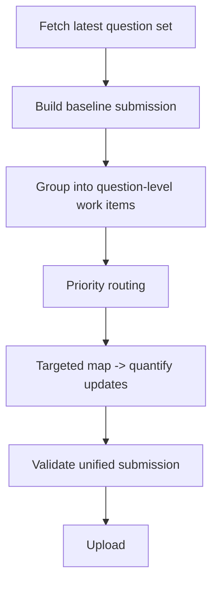

# ForecastBench Workflow Synthesis

Combined the context review, the root probability-skill review, and the checked local question-set shape into a concrete participant-side workflow for benchmark day.

Workload facts to design around:
- The checked local round expands 500 questions into 2248 submission rows.
- The preliminary planning view is 1998 dataset rows across 250 dataset questions.
- Dataset questions are evenly split across `acled`, `dbnomics`, `fred`, `wikipedia`, and `yfinance`.
- Almost every dataset question has 8 horizons, so the right unit of work is one question with a horizon ladder, not eight separate row analyses.

Top-level design decisions:
- Guarantee coverage first with a cheap baseline submission, then selectively overwrite the rows that deserve more effort.
- Spend the full analysis budget on preliminary dataset questions that have one or more resolution rows within the first month.
- Leave every other row on the no-compute baseline, including market questions and preliminary rows beyond the first month.
- Reuse the root skill's map->quantify pattern and LR budgeting, but replace its Polymarket-shaped intake with a ForecastBench question packet.
- Keep one unified submission artifact; preliminary remains a planning lens only.

Learnings
- Tried reasoning at row level first, then switched to question-level work items because dataset evidence is shared across the 7-8 horizons for the same `id`.
- A follow-up agent could easily waste effort by treating all first-month preliminary rows as separate analyses. The efficient move is to analyze the underlying dataset questions once and overwrite only the first-month rows that matter.
- The durable mental model is: baseline first for safety, question-level grouping for efficiency, and full workflow only on first-month preliminary targets.

## Diagram

[[1775712512821qMj]]
