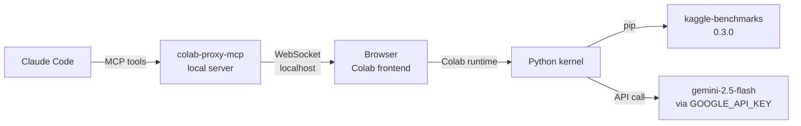

# Colab via colab-mcp — feasibility spike complete

Assessed colab-proxy-mcp as alternative to Kaggle Option A bridge. Verdict: viable, comparable friction. Added .mcp.json config and colab_runner.py drop-in. Blocked only on user providing GOOGLE_API_KEY.

## Architecture (how colab-mcp works)

1. `uvx git+https://github.com/googlecolab/colab-mcp` runs a local MCP server + WebSocket server (random localhost port)
2. MCP tool `open_colab_browser_connection` opens `colab.research.google.com/notebooks/empty.ipynb#mcpProxyToken=TOKEN&mcpProxyPort=PORT` in the browser
3. Colab's **frontend JavaScript** (running locally in the browser) reads the URL fragment and connects to the local WS server — no tunnel needed
4. Claude can then execute code in Colab via MCP tools proxied through the browser

## Comparison vs Kaggle Option A

| Aspect | Kaggle Option A | Colab + colab-mcp |
|--------|----------------|-------------------|
| Auth | Copy KAGGLE_JUPYTER_URL + TOKEN from Kaggle UI → `.env` | Browser auto-connects (no token extraction) |
| Token expiry | Tokens expire on notebook refresh | N/A — browser session |
| `kbench.llm` | Pre-configured in Kaggle kernel | Not in PyPI package; need `GoogleGenAI(api_key=...)` |
| `kaggle-benchmarks` pkg | Pre-installed in Kaggle kernel | pip-installable (PyPI v0.3.0) ✅ |
| Leaderboard submission | Direct (kbench registers tasks) | Not direct — would need manual step |
| Task file changes needed | None | Minor: need to provide own LLM instance |

## Key finding: kaggle-benchmarks IS on PyPI

```
pip install kaggle-benchmarks==0.3.0  # installs fine
```

But `kbench.llm` (the Kaggle-injected LLM) does NOT exist in the PyPI version. The package provides `GoogleGenAI` and `OpenAI` subclasses of `LLMChat` instead.

## What colab_runner.py does

Drop-in replacement for the Kaggle bridge — loads the same `@kbench.task` files but supplies `GoogleGenAI` instead of `kbench.llm`:

```python
from google import genai
from kaggle_benchmarks.actors.llms import GoogleGenAI

def _make_llm():
    client = genai.Client(api_key=os.environ["GOOGLE_API_KEY"])
    return GoogleGenAI(client=client, model="gemini-2.5-flash")

def run_task(task_file):
    # loads @kbench.task file, runs with _make_llm(), prints JSON result
```

## .mcp.json change (added colab-proxy-mcp)

```json
{
  "mcpServers": {
    "voicetree": { "type": "http", "url": "http://127.0.0.1:3002/mcp" },
    "colab-proxy-mcp": {
      "command": "uvx",
      "args": ["git+https://github.com/googlecolab/colab-mcp"],
      "timeout": 30000
    }
  }
}
```

## To run the pilot via Colab right now

1. User provides `GOOGLE_API_KEY` (free at aistudio.google.com)
2. Restart Claude Code so `colab-proxy-mcp` tools load
3. Claude calls `open_colab_browser_connection` → Colab opens in browser
4. In Colab: `!pip install kaggle-benchmarks google-genai`
5. Run: `python colab_runner.py kaggle/examples/hch_spike/q1.py`

## Files Changed

- /Users/bobbobby/repos/voicetree-evals/metabench/.mcp.json
- /Users/bobbobby/repos/voicetree-evals/metabench/kaggle/colab_runner.py

## Diagram



### NOTES

- colab-mcp v1 hardcodes empty.ipynb as entry point — user navigates to their notebook after connection, or we just run code there
- The Kaggle-exported notebook URL is time-limited (3 days from signing). Colab sidesteps this — no Kaggle-specific URL needed
- kbench task files are fully reusable — only the LLM injection point changes (kbench.llm → GoogleGenAI instance)
- Leaderboard submission still requires the Kaggle UI 'Save Task' step — Colab approach doesn't change that

[[hch-metacog-spike-orchestration-done_1_0]]
