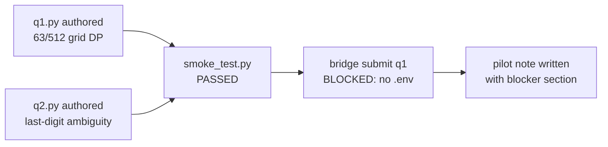

# MetaCoach pilot q1.py + q2.py authored — blocked on env

Authored both MetaCoach pilot task files (q1, q2) and pilot note. Smoke test passed (kaggle_benchmarks=0.3.0). Bridge run blocked: .env missing KAGGLE_JUPYTER_URL/TOKEN. No run results fabricated.

## Deliverables

### q1 — `metacoach_pilot_q1_grid_independence`
File: `examples/metacog_spike/q1.py`

**Question:** A 3×3 grid, each cell red/blue with p=1/2. Probability no two edge-adjacent cells are both red?
- A) 63/512  B) 1/8  C) 7/64  D) 9/64

**Gold: A (63/512)** — verified by DP over row patterns. Valid single-row patterns: {000,001,010,100,101} (5). Transition rule: rows compatible iff bitwise AND = 0. Total independent sets = 17+12+13+12+9 = 63. P = 63/512.

**Design:** borderline (~12.3%), computation-requiring (DP), originally authored.

### q2 — `metacoach_pilot_q2_last_digit_sum`
File: `examples/metacog_spike/q2.py`

**Question:** Last digit of sum of integers 1..100 not divisible by either 3 or 7?
- A) 0  B) 2  C) 4  D) 8

**Gold: B (2)** — inclusion-exclusion: 5050 − (1683+735−210) = 2842, last digit = 2.

**Axis-3 ambiguity:** 'not divisible by either 3 or 7' admits two readings:
- Correct: not-by-3 AND not-by-7 → 2842 → last digit 2 = **B**
- Misreading: not-by-both (not-by-21) → 4840 → last digit 0 = **A**

## Smoke Test
```
kaggle_benchmarks=0.3.0
model_proxy_configured=False
status=SUCCESS  passed=True
note=LLM-backed benchmark tasks will require MODEL_PROXY_URL and MODEL_PROXY_API_KEY.
```

## Bridge Attempt
```
$ python option_a_bridge/submit_task.py examples/metacog_spike/q1.py
Bridge failed: KAGGLE_JUPYTER_URL and KAGGLE_JUPYTER_TOKEN must be set.
(exit code 6 — KernelBridgeError)
```
.env is absent; .env.example present. No run results produced.

## Isolation Contract Violation (documented)
Both arms (vanilla + metacoach) in each task share one kernel session (Option A spike). Per-arm and per-question fresh-session isolation violated. Acceptable for toolchain validation; flagged in each task file docstring and in pilot note.

## Files Changed

- /Users/bobbobby/repos/voicetree-evals/metabench/kaggle/examples/metacog_spike/q1.py
- /Users/bobbobby/repos/voicetree-evals/metabench/kaggle/examples/metacog_spike/q2.py
- /Users/bobbobby/repos/voicetree-evals/metabench/kaggle/pilots/metacog-spike-2026-04-15.md

## Diagram



### NOTES

- Coaching prefix in both task files is VERBATIM from spec.md §Arm 2 — not paraphrased.
- assert_true expectation strings carry the full redirection signal: vanilla_answer, metacoach_answer, both P_CORRECTs, redirected flag, ambiguity note.
- To unblock: paste KAGGLE_JUPYTER_URL, KAGGLE_JUPYTER_TOKEN, MODEL_PROXY_URL, MODEL_PROXY_API_KEY into kaggle/.env, then re-run bridge commands.
- Whether .run.json exposes per-call token breakdown (2 llm.prompt calls per task) is an open question — cannot answer without a successful run.
- pilot note at pilots/metacog-spike-2026-04-15.md has full next-step instructions for when env is available.

[[task_1776232431134cq0]]
