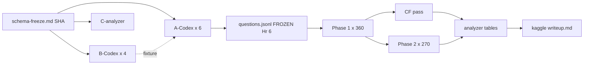

# Factory Orchestration — Hr-by-Hr Implementation

14-hour sequencing using voicetree MCP: Hr 0–1 schema freeze + spawn, Hr 1–3 parallel build + first fixture, Hr 3–6 consolidate + spot-check, Hr 6–10 Phase 1 fire (gated on frozen questions.jsonl), Hr 10–14 Phase 2 + CF + writeup package.

# Factory Orchestration — Hr-by-Hr

## Mechanism (voicetree MCP)
- Each factory **lead** runs in its own voicetree terminal.
- `spawn_agent` creates Codex subagents; brief includes pinned `schema-freeze.md` commit SHA + explicit write-path whitelist.
- Leads gate with `wait_for_agents` on two events: schema freeze (Hr 1), questions.jsonl freeze (Hr 6).
- Each lead drops one hourly progress node (per factory-plan coordination requirement).

## Hr 0–1 — Schema freeze + spawn (SEQUENTIAL, blocks everything)
1. **B-lead** writes `schema-freeze.md` + skeleton `harness/protocol.py` (types only, no logic). `git commit`, record SHA.
2. **C-lead** writes `predictions.md` seeded from [[experiment-theory]]; commits.
3. **A-lead** reads frozen SHA, writes `.coordination/factory-a.md` with 6 per-class Codex briefs.
4. All 10 Codex (6×A, 4×B, 1×C-analyzer) spawned in parallel, each receiving the SHA.

**Gate:** no Factory A or C work may read protocol fields before this commits.

## Hr 1–3 — Parallel implementation (MAX FAN-OUT)
- **A-Codex × 6** (CJS, Steiner, GraphCol, TSP, MWIS, VE) — each isolated to `benchmark/generators/{class}.py`, `benchmark/verifiers/{class}.py`, `benchmark/questions/{class}_{medium,hard}.jsonl`. Baselines from `hch/` noted in factory-plan.
- **B-Codex × 4** — protocol (fills skeleton), extractor, runner, kaggle-adapter+writeup scaffolding.
- **C-analyzer (Codex)** — scaffolds `analyzer/extract_metrics.py` stubs against schema fields.
- **C-writer (Opus)** — drafts `paper/main.md` methodology + pre-reg sections.

## Hr 2–3 — First end-to-end fixture (BLOCKING CHECK, risk mitigation)
B-lead runs `scripts/run_session.py` on CJS-5×6 medium seed-1 **the moment A-CJS commits its first row**. Exercises: prompt → raw-string loop → extractor → verifier → scoring → CF. Any contract drift fails fast, before other 5 classes finish.

Also in parallel: B-extractor validated against `tests/fixtures/` raw transcripts from all 3 model shapes.

## Hr 3–6 — Consolidate + spot-check
- A-lead runs 1 Gemini 3 Pro session per (class × difficulty) via harness → verifier passes. Bugs ping respective A-Codex.
- A-lead runs `scripts/build_questions.py`: globs `benchmark/questions/*.jsonl` → consolidates to `benchmark/questions.jsonl` + `scripts/recompute_gold.py`. **A-lead is sole writer of this file.**
- C-critic (separate Opus agent) red-teams `predictions.md`; C-writer iterates. This finalizes BEFORE phase 1 fires.

## Hr 6 — FREEZE GATE
`questions.jsonl` commit SHA becomes immutable. Any change = v2. `scripts/validate_schema.py` run as a pre-Phase-1 gate.

## Hr 6–10 — Phase 1 fires (360 runs)
- `scripts/run_phase1.py` fans out 3 models × 120 solo, parallel-5 Kaggle kernels. Stream → `results/phase1/{model}/`.
- **C-analyzer pipelined**: extracts metrics per completed session (no batch wait).
- B-lead monitors extractor failure rate; long-transcript retry path.
- B-Codex (kaggle) finalizes `kaggle/tasks/*.py` and `kaggle/benchmark.py` against frozen schema.

## Hr 10–14 — Phase 2 + CF + writeup package
- `scripts/run_phase2.py`: 270 portfolio runs.
- `scripts/run_cf_pass.py` pipelined: each clean-stop session forks +1 turn → `results/cf/`.
- Reference leaderboard: Gemini 3 Pro × seed 1 × 210 → `results/reference/`.
- C-writer finalizes results section consuming `analyzer/tables.py` output.
- C-critic final red-team pass on `paper/main.md` + `kaggle/writeup.md` (≤1500 words, template-compliant).
- B-lead assembles Kaggle submission: notebook.ipynb exported from reference run, writeup.md compressed from paper/main.md, cover.png in, kernel-metadata.json validated, Benchmark + 210 Tasks published privately via SDK.

## Fallback shedding (if compute tight)
- Drop seeds 10 → 5 per cell: Phase 1 becomes 180 runs, preserves 6-class coverage.
- Drop MWIS/VE to 1 difficulty (factory-plan risk #1 prediction): 100 solo instead of 120.

## Hand-offs summary (what blocks what)
See diagram.

## Diagram

### NOTES

- The Hr 2–3 fixture check is the load-bearing risk mitigation — don't skip to save time, it saves time downstream.
- A-lead consolidation script build_questions.py must be trivially deterministic (sorted glob + concat) so re-runs are idempotent.
- C-writer must start BEFORE Phase 1 data exists — methodology + pre-reg can be written against the schema alone.

sequencing [[kaggle-submission-design]]
