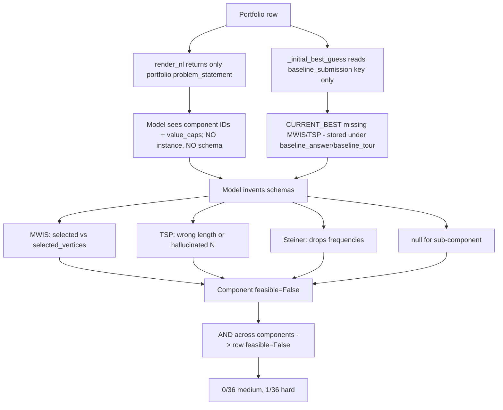

# Portfolio Infeasibility — root cause + fix (index)

Portfolio is broken at the PROMPT layer, not the model layer. `render_nl(portfolio)` emits only `problem_id|class|value_cap`; NO sub-component instance data, NO per-class answer schema, NO baseline seed for MWIS/TSP. Models invent sub-component submissions and hallucinate schemas, producing ~1/72 feasibility.

## Headline (plain English)

**The portfolio prompt never shows the model the sub-component data or their answer schemas.** `render_nl(portfolio)` returns only a bullet list of `problem_id | class | value_cap` — no graph, no jobs, no coords, no per-class JSON schema. The solo classes work because the solo `problem_statement` is self-contained and `_best_guess_schema_block` returns the per-class schema docstring; for `cls="portfolio"`, both of these are empty shells. Models are asked to emit JSON for 3 sub-components they have never seen, so they guess the key names (Sonnet wrote `"selected"` instead of `"selected_vertices"` for MWIS), invent fields (Gemini substituted Steiner city names into the TSP tour), drop required fields (Gemini dropped Steiner `frequencies`), or emit `null` for an entire sub-component (GPT). This is a prompt-construction bug.

## Tree of findings

- **Evidence** — traced end-to-end across 3 rows × 3 models (child: `portfolio-infeasibility-evidence`)
- **Mechanism** — the 4 specific code-paths that drop sub-component data (child: `portfolio-infeasibility-mechanism`)
- **Citations** — file:line map of prompt + scorer (child: `portfolio-infeasibility-citations`)
- **Fix proposal** — 5 ordered fixes with impact estimates (child: `portfolio-infeasibility-fix-proposal`)
- **Open questions** — VE/Graphcol not traced, rescue path not applicable (child: `portfolio-infeasibility-open-questions`)

## Deliverable summary

- Root cause: prompt-construction bug; portfolio instance rendering drops all sub-component data and per-class schemas.
- Primary fix: thread `components` into `render_nl` and emit per-component instance NL + `CLASS_TO_BEST_GUESS_SCHEMA` inline.
- Secondary fix: seed `current_best` from `baseline_answer`/`baseline_tour` keys for MWIS/TSP.
- Expected portfolio feasibility after fixes 1+2+3: 0% → ~70% medium, 3% → ~50% hard.

## Diagram

[[task_1776373751566rv9]]
